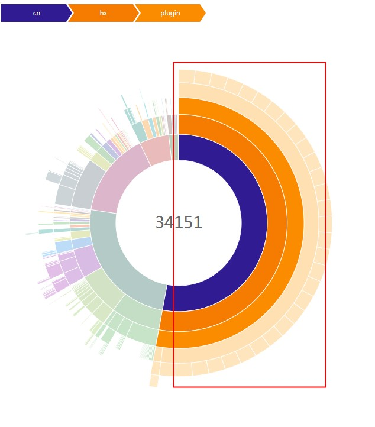

# Android垃圾代码生成插件

此插件用于做马甲包时，减小马甲包与主包的代码相似度，避免被某些应用市场识别为马甲包。

### 使用方法

根目录的build.gradle中：

```
buildscript {
    repositories {
        mavenCentral()
    }
    dependencies {
        classpath "com.github.qq549631030:android-junk-code:x.x.x" //x.x.x换成最新的插件版本号
    }
}
```

app目录的build.gradle模块中：

```groovy
apply plugin: 'com.android.application'
apply plugin: 'android-junk-code'

androidJunkCode {
    variantConfig {
        release {
//注意：这里的release是变体名称，如果没有设置productFlavors就是buildType名称，如果有设置productFlavors就是flavor+buildType，例如（freeRelease、proRelease）
            packageBase = "cn.hx.plugin.ui"  //生成java类根包名
            packageCount = 30 //生成包数量
            activityCountPerPackage = 3 //每个包下生成Activity类数量
            excludeActivityJavaFile = false
            //是否排除生成Activity的Java文件,默认false(layout和写入AndroidManifest.xml还会执行)，主要用于处理类似神策全埋点编译过慢问题
            otherCountPerPackage = 50  //每个包下生成其它类的数量
            methodCountPerClass = 20  //每个类下生成方法数量
            resPrefix = "junk_"  //生成的layout、drawable、string等资源名前缀
            drawableCount = 300  //生成drawable资源数量
            stringCount = 300  //生成string数量
        }
    }
}
```

如果有多个变体共用一个配置可以这样做

```groovy
androidJunkCode {
    def config = {
        packageBase = "cn.hx.plugin.ui"
        packageCount = 30
        activityCountPerPackage = 3
        excludeActivityJavaFile = false
        otherCountPerPackage = 50
        methodCountPerClass = 20
        resPrefix = "junk_"
        drawableCount = 300
        stringCount = 300
    }
    variantConfig {
        //注意：这里的debug,release为变体名称，如果没有设置productFlavors就是buildType名称，如果有设置productFlavors就是flavor+buildType，例如（freeRelease、proRelease）
        debug config
        release config
    }
}
```

如果APP开启了混淆，需要在混淆文件里配置

```
#cn.hx.plugin.ui为前面配置的packageBase
-keep class cn.hx.plugin.ui.** {*;}
```

**如果不想用插件默认生成的代码，可通过下面实现自定义。注意，修改生成方式后必须先clean再build才生效**

```groovy
androidJunkCode {
    variantConfig {
        release {
            packageBase = "cn.hx.plugin.ui"
            packageCount = 30
            activityCountPerPackage = 30
            excludeActivityJavaFile = false
            otherCountPerPackage = 50
            methodCountPerClass = 20
            resPrefix = "junk_"
            drawableCount = 300
            stringCount = 300

            //自定义生成包名(设置此项后packageBase将无效)
            //注意，要把生成的包名加入混淆文件
            packageCreator = { tuple2 ->
                //int:下标 [0,packageCount)
                def index = tuple2.first
                //StringBuilder: 生成包名格式xx.xx.xx
                def packageNameBuilder = tuple2.second
                packageNameBuilder.append("cn.hx.package" + index)
            }

            /**
             * 自定义生成Activity
             */
            activityCreator = { tuple4 ->
                //int:下标 [0,activityCountPerPackage)
                def index = tuple4.first
                //StringBuilder: 生成Activity文件名
                def activityNameBuilder = tuple4.second
                //StringBuilder: 生成layout文件名
                def layoutNameBuilder = tuple4.third
                //StringBuilder: 生成layout内容
                def layoutContentBuilder = tuple4.fourth

                //例
                activityNameBuilder.append("Activity${index}")
                layoutNameBuilder.append("activity_${index}")
                layoutContentBuilder.append('''<?xml version="1.0" encoding="utf-8"?>
<LinearLayout xmlns:android="http://schemas.android.com/apk/res/android"
    android:layout_width="match_parent"
    android:layout_height="match_parent"
    android:orientation="vertical">

    <TextView
        android:layout_width="wrap_content"
        android:layout_height="wrap_content"
        android:layout_gravity="center" />
</LinearLayout>''')
            }

            //自定义生成类名（Activity除外）
            classNameCreator = { tuple2 ->
                //int:下标 [0,otherCountPerPackage)
                def index = tuple2.first
                //StringBuilder: 生成Java文件名
                def classNameBuilder = tuple2.second

                //例
                classNameBuilder.append("Class${index}")
            }

            //自定义生成方法名
            methodNameCreator = { tuple2 ->
                //int:下标 [0,methodCountPerClass)
                def index = tuple2.first
                //StringBuilder: 生成的方法名
                def classNameBuilder = tuple2.second

                //例
                classNameBuilder.append("method${index}")
            }

            //自定义生成drawable（只支持xml）
            drawableCreator = { tuple3 ->
                //int:下标 [0,drawableCount)
                def index = tuple3.first
                //StringBuilder: 生成drawable文件名
                def fileNameBuilder = tuple3.second
                //StringBuilder: 生成drawable文件内容
                def contentBuilder = tuple3.third

                //例
                fileNameBuilder.append("drawable${index}")
                contentBuilder.append('''<?xml version="1.0" encoding="utf-8"?>
<shape xmlns:android="http://schemas.android.com/apk/res/android">
    <corners android:radius="4dp" />
    <stroke
        android:width="1dp"
        android:color="#333333" />
</shape>
''')
            }

            //自定义生成 string
            stringCreator = { tuple3 ->
                //int:下标 [0,drawableCount)
                def index = tuple3.first
                //StringBuilder: 生成string名
                def keyBuilder = tuple3.second
                //StringBuilder: 生成string值
                def valueBuilder = tuple3.third

                //例
                keyBuilder.append("string${index}")
                valueBuilder.append("value${index}")
            }

            //自定义生成keep.xm
            keepCreator = { tuple2 ->
                //StringBuilder:生成文件名
                def fileNameBuilder = tuple2.first
                //StringBuilder: 生成的文件内容
                def contentBuilder = tuple2.second

                //例
                fileNameBuilder.append("android_junk_code_keep")
                contentBuilder.append( "<resources xmlns:tools=\"http://schemas.android.com/tools\"\n" +
                        "    tools:keep=\"@layout/junk_*, @drawable/junk_*\" />\n")
            }

            //自定义类实现（类名已经实现随机，Activity类已经实现了onCreate，其它自己实现随机）
            //注意设置了此实现将忽略 methodGenerator,methodCountPerClass
            //TypeSpec.Builder用法请参考(https://github.com/square/javapoet)
//            typeGenerator = { typeBuilder ->
//                //例
//                for (i in 0..<10) {
//                    typeBuilder.addMethod(MethodSpec.methodBuilder("method" + i)
//                            .addCode("" + "int total = 0;\n" + "for (int i = 0; i < 10; i++) {\n" + "  total += i;\n" + "}\n")
//                            .build())
//                }
//            }

            //自定义方法实现（方法名已经实现随机，其它自己实现随机）
            //MethodSpec.Builder用法请参考(https://github.com/square/javapoet)
//            methodGenerator = { methodBuilder ->
//               //例
//                methodBuilder.addCode("" + "int total = 0;\n" + "for (int i = 0; i < 10; i++) {\n" + "  total += i;\n" + "}\n")
//            }
        }
    }
}
```

如果所有代码生成都不想用插件来完成，可用如下实现。插件只负责把你生成的文件打进包里

```groovy
androidJunkCode {
    variantConfig {
        release {
            javaGenerator = { javaDir ->
                //File:java目录
                //把你生成的所有java文件放到这个目录下
            }
            resGenerator = { resDir ->
                //File:res目录
                //把你生成的所有资源文件放到这个目录下
            }

            manifestGenerator = { manifestFile ->
                //File:AndroidManifest.xml文件
                //把你生成的AndroidManifest.xml内容写入到这个文件
            }
        }
    }
}
```

### 打包

执行配置变体的打包命令：assembleXXX（XXX是你配置的变体，如：assembleRelease、assembleFreeRelease）

### 生成文件所在目录

*AGP 7.4.0以前*
build/generated/source/junk  

*AGP 7.4.0以后 （XXX是你配置的变体首字母大写，如：Release、FreeRelease）*
build/generated/java/generateXXXJunkCode   
build/generated/res/generateXXXJunkCode   
build/generated/source/junk/XXX/AndroidManifest.xml  

### 使用插件[methodCount](https://github.com/KeepSafe/dexcount-gradle-plugin)对比

#### 未加垃圾代码

**项目代码占比 0.13%**


#### 加了垃圾代码

**项目代码占比 52.93%**



安利我的两个新库：  
[PriorityDialog](https://github.com/qq549631030/PriorityDialog)（带优先级对话框实现）  
[ActivityResultApi](https://github.com/qq549631030/ActivityResultApi)（Activity Result Api封装，支持免注册调用）
